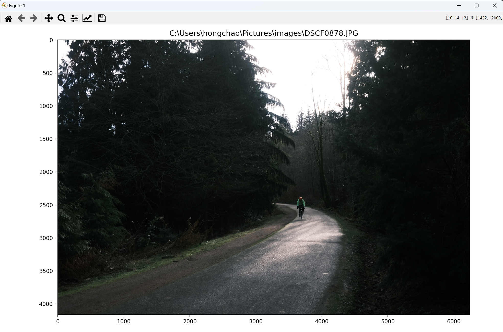

# assignment1

### Dear professor, I want to ask for three days of time travel, since I got an important interview this Friday. 

### I cannot resubmit on Gradescope after the deadline, so please check and grade this repo: https://github.com/CosimoFang/assignment1 after three days. Thanks again for the flexibility


Here is the picture:

<p align="center">
  
</p>

I compile my code on Windows using Visual Studio Code

Instructions for running your executables.
If you want to redo the test, just run:
```
imgDisplay.cpp {image_path}
vidDisplay.cpp
```
I added the extension function for the user to save the modified images.


